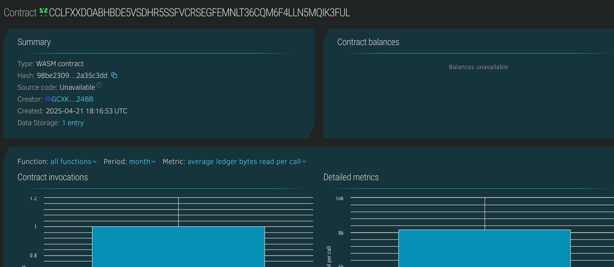

# Tokenized Property Ownership

## Project Title
Tokenized Property Ownership

## Project Description
Tokenized Property Ownership is a Soroban-based smart contract platform that enables fractional ownership of real estate and property assets on the Stellar blockchain. The system allows property owners to tokenize their assets by dividing them into shares that can be purchased by investors, creating a decentralized marketplace for real estate investment.

This platform bridges the gap between traditional real estate ownership and blockchain technology, making property investment more accessible and liquid. By representing property ownership as digital shares on the blockchain, the system enables fractional investment, transparent ownership records, and streamlined property transactions without the traditional barriers of real estate investment.

## Project Vision
The vision for Tokenized Property Ownership is to democratize access to real estate investment by breaking down barriers of entry and creating new opportunities for fractional ownership. By tokenizing property assets, we aim to transform real estate from an illiquid, high-threshold investment class into a flexible, accessible market where investors of all sizes can participate.

Our goal is to build a transparent, efficient, and inclusive property investment ecosystem that leverages blockchain technology to solve traditional real estate challenges including high entry costs, illiquidity, complex transactions, and geographical limitations. We envision a future where property ownership is as seamless as stock ownership, where assets can be traded easily, and where verification of ownership is immutable and transparent.

## Key Features

1. **Property Tokenization**:
   - Register real-world properties on the blockchain
   - Divide property ownership into tradable shares
   - Associate detailed property information with tokens

2. **Fractional Ownership**:
   - Purchase partial ownership in property assets
   - Own and trade specific numbers of shares
   - Track ownership records transparently

3. **Property Management**:
   - Update property status (Active, Under Maintenance, For Sale, Inactive)
   - Modify pricing of available shares
   - Maintain property details and documentation

4. **Investment Tracking**:
   - Record share acquisitions with timestamps
   - Track ownership across multiple properties
   - Monitor available shares for each property

5. **Blockchain-Based Verification**:
   - Provide immutable ownership records
   - Verify property details through blockchain
   - Authenticate transactions with digital signatures

## Future Scope

1. **Secondary Market Development**:
   - Enable peer-to-peer trading of property shares
   - Create a decentralized marketplace for property tokens
   - Implement bidding and auction mechanisms

2. **Property Income Distribution**:
   - Automated rental income distribution to shareholders
   - Dividend payment systems based on ownership percentage
   - Revenue tracking and reporting

3. **Enhanced Property Management**:
   - Voting systems for property decisions
   - Maintenance fund management
   - Property improvement proposals and tracking

4. **Integration with Real-World Services**:
   - Legal documentation automation
   - Property valuation services
   - Tax reporting and compliance tools

5. **Geographic Expansion**:
   - Support for international properties
   - Multi-currency pricing and payments
   - Jurisdiction-specific compliance features

6. **Extended Financial Tools**:
   - Collateralized lending against property shares
   - Automated mortgage distribution
   - Investment portfolio management

7. **Enhanced Analytics**:
   - Property performance metrics
   - Market comparison tools
   - Investment return calculations
   - Property value appreciation tracking

## Contract Details
CCLFXXDOABHBDE5VSDHR5SSFVCRSEGFEMNLT36CQM6F4LLN5MQIK3FUL
